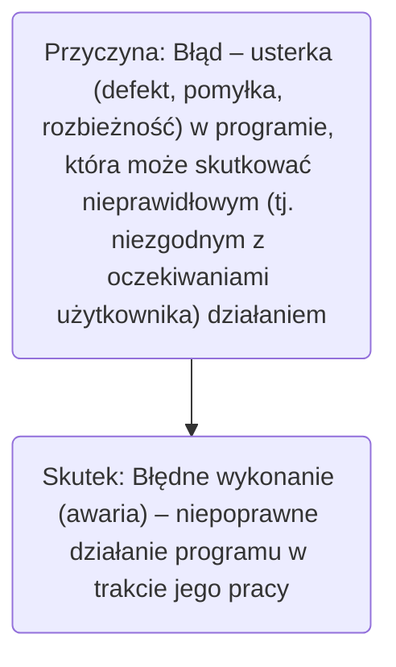
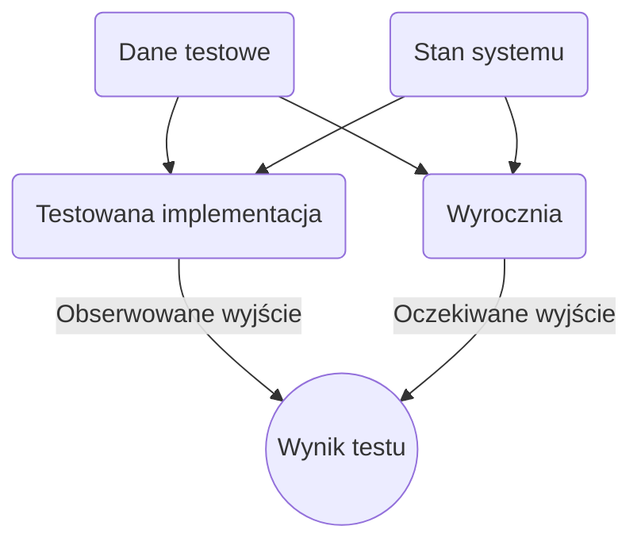
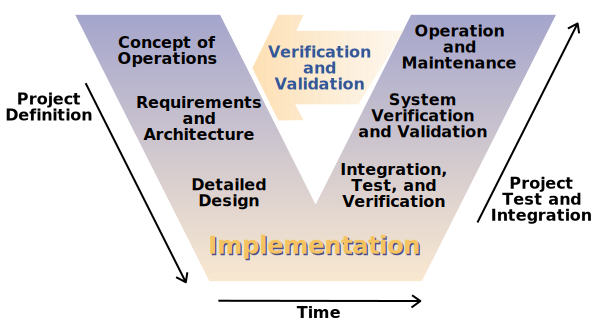

# Wprowadzenie do testowania

 - Skutkiem błędu w programie może być wiele jego błędnych wykonań 
 - Takie samo błędne wykonanie programu może być skutkiem różnych błędów

 ## Najbardziej spektakularne błędy w programach oraz ich skutki
  - 1988: Zestrzelenie samolotu Airbus A320 – śmierć 290 osób 
  - 1991: Błąd naprowadzania rakiet Patriot – śmierć 28 osób 
  - 1994: Błąd dzielenia zmiennoprzecinkowego w procesorze Pentium – koszt ok. 475 000 000 USD 
  - 1996: Katastrofa rakiety Ariane5 – koszt ok. 500 000 000 USD 
  - 1999: Katastrofa sondy kosmicznej Mars Polar Lander 5 – koszt samego lądownika ok. 120 000 000 USD 
  - 2000: „pluskwa milenijna”

## Kiedy w oprogramowaniu znajduje się błąd? 
 - Oprogramowanie nie wykonuje czegoś, co według specyfikacji powinno wykonywać 
 - Oprogramowanie robi coś, czego według specyfikacji nie powinno robić 
 - Oprogramowanie wykonuje coś, o czym specyfikacja w ogóle nie wspomina 
 - Oprogramowanie nie wykonuje czegoś, o czym specyfikacja nie wspomina, ale powinna 
 - Oprogramowanie jest trudne do zrozumienia, trudne do użycia, powolne albo – zdaniem testera – będzie w oczach użytkownika po prostu nieprawidłowe

 ## Źródła powstawania błędów, udział od największych do najmniejszych
  - Specyfikacja,
  - Projekt,
  - Kod,
  - Inne.

Istotnymi czynnikami mającymi wpływ na powstawanie błędów wprogramach jest ich rosnąca złożoność i wielkość.

## Kontekst i zrozumienie

## Błędy w programie można rozpatrywać na poziomie: 
 - mechanizmu powstawania błędu (error), związanego najczęściej zfazą analizy wymagań i projektowania (błędne założenia projektowe, niewłaściwa interpretacja specyfikacji, dobór niewłaściwego algorytmu, itp.) 
 - programowym (fault), związanym najczęściej z fazą implementacji (błędy programisty)
 - użytkowym ( failure ), kiedy można zaobserwować błędne działanie funkcji program

## Szacunkowe koszty błędów

Dynamiczny rozwój branży IT powoduje obserwowalne i rosnące koszty będące skutkami błędów w programach

| Faza           | Koszt [EUR] | czas naprawy [h] |
| ---            |  ------     | ---------:       |
| Analiza        | 1           | 0.1              |
| Projektowanie  | 5           | 0.5              |
| Kodowanie      | 10          | 1                |
| Testowanie     | 15-50       | 1.5-5            |
| Wdrożenie      | >100        | >10              |

## Czy testowanie się opłaca?
 - Scenariusz #1: 
   - Liczba błędów znalezionych w programie – 1000 
   - Liczba błędów znalezionych przez deweloperów – 750 
   - Liczba błędów znalezionych przez użytkowników – 250 
   - Średni koszt wykrycia i naprawy błędu: przed wdrożeniem – 10€, po wdrożeniu – 250€
   - Koszt zapewnienia jakości: 750 * 10€ + 250 * 250€ = 70 000€
 - Scenariusz #2:
   - Liczba błędów znalezionych w programie – 1000 
   - Liczba błędów znalezionych przez deweloperów – 750 
   - Liczba błędów znalezionych przez testerów – 200 
   - Liczba błędów znalezionych przez użytkowników – 50 
   - Średni koszt wykrycia i naprawy błędu: przed testowaniem – 10€, w fazie testowania – 50€, po wdrożeniu – 250€
   - Koszt przygotowania i przeprowadzenia testów – 10 000
   - Koszt zapewnienia jakości: 750 * 10€ + 200 * 50€ + 50 * 250€ + 10 000€ = 40 000€
- Wniosek: Naprawa błędnego oprogramowania jest droższa (finansowoi marketingowo) niż koszt pracy testerów

## Podstawowe pojęcia
 - Testowanie oprogramowania to wykonanie kodu dla różnych kombinacji danych wejściowych i stanów, mające na celu wykrycie błędów w programie
 - Zasadniczym celem testowania jest dążenie do uzyskania odpowiednio wysokiego poziomu niezawodności i jakości oprogramowania, stosownie do zdefiniowanych wymagań, ograniczeń czasowych i kryteriów ekonomicznych
 - Testowanie powinno umożliwiać wykrycie jak największej liczby błędów → wzrost niezawodności programu
 - Testowanie powinno zapewniać na jak najwcześniejsze wykrycie błędów → redukcja kosztów naprawy błędów
 - Test zakończony sukcesem to test, którego skutkiem jest wykrycie nieznalezionego dotychczas błędu w programie 
 - Test uznaje się za efektywny, jeżeli ma zdolność wykrycia jaknajwiększej liczby błędów zjak największym prawdopodobieństwem
 - Uruchamianie programów („odpluskwianie”, debugowanie) jest działaniem mającym na celu zlokalizowanie, a następnie poprawienie wykrytych w trakcie testowania błędów 
 - Do uruchamiania programów wykorzystuje się przypadki testowe zaprojektowane w taki sposób, aby były pomocne wznajdowaniu przyczyny błędu 
 - Uruchamianie programów jest procesem, w trakcie którego formułuje się, a następnie weryfikuje praktycznie hipotezy, dotyczące przyczyn błędnego działania programu 
 - W trakcie debugowaniabardzo pomocne jest doświadczenie iwiedza, dotycząca typowych błędów programistycznych

## Podstawowe zasady
  - podczas testowania ważniejsze jest sprawdzenie typowych przypadków użycia programu, niż przypadków rzadkich (skrajnych) 
  - testowanie istniejącej funkcjonalności programu powinno być ważniejsze od testowania nowej funkcjonalności 
  - należy unikać testowania przez autorów oprogramowania 
  - należy dokumentować testy i zasady ich użycia 
  - należy zbierać i poddawać analizie wyniki testów 
  - trzeba uwzględniać w testach zarówno poprawne, jak i niepoprawne dane wejściowe oraz warunki wykonania 
  - należy sprawdzać, nie tylko czy w trakcie działania program wykonuje to co powinien, ale także czy nie wykonuje tego, czego nie powinien

# Walidacja i weryfikacja oprogramowania

 - Atestowanie, walidacja (validation) jest sprawdzaniem zgodności działania programu z oczekiwaniami użytkownika w rzeczywistych warunkach i w środowisku, dla których został on zaprojektowany Walidacja zajmuje się wykrywaniem błędów związanych znieprawidłową specyfikacją wymagań
 - Weryfikacja (verification) jest procesem mającym na celu sprawdzenie, czy program na danym etapie wytwarzania jest zgodny z wymaganiami i oczekiwaniami użytkownika Weryfikacja nie zajmuje się wykrywaniem błędów związanych z nieprawidłową specyfikacją wymagań

 - Walidacja stara się odpowiedzieć na pytanie: „Czy budujemy prawidłowy produkt?” i w tym sensie dotyczy całościowej oceny programu pod kątem spełniania oczekiwań użytkownika
 - Weryfikacja natomiast stara się odpowiedzieć na pytanie: „Czy prawidłowo budujemy produkt?” i obejmuje szerszy zakres zagadnień niż testowanie
 - Zarówno weryfikacja, jak i walidacja powinny być wykonywane na każdym etapie tworzenia oprogramowania

 - Weryfikacja może mieć charakter: 
   - statyczny – związany z analizą (przeglądem, inspekcją) specyfikacji, projektu lub kodu programu (bez konieczności jego uruchamiania) 
   - dynamiczny – polegający na wykonaniu programu lub jego fragmentu  z danymi testowymi i porównaniu uzyskanych wyników z wynikami poprawnymi → testowanie oprogramowania
 - Typową techniką statycznej weryfikacji są inspekcje kodu, podczas których zespoły inspekcyjne dokonują przeglądu kodu pod kątem sprawdzenia jego poprawności oraz spełnienia dodatkowych kryteriów (prostota, poprawność zastosowanych konstrukcji programistycznych, zgodność ze standardami kodowania, …)

 - Inną formą statycznej weryfikacji kodu jest zastosowanie narzędzi do automatycznej analizy kodu Tego typu analizatory przeglądają kod źródłowy analizując jego składnię, np. w celu sprawdzenia poprawności użytych konstrukcji programistycznych, czy też wnioskowania oprzepływie sterowania w programie. Automatyczne analizatory kodu bazują na metodach formalnych, które dla wielu systemów generują bardzo wysokie koszty, a ponadto nie są w stanie poradzić sobie ztrudnościami podczas definiowania wymagań

## Weryfikacja dynamiczna – testowanie kodu programu lub jego fragmentu

 - Kod poddawany testowaniu to: 
   - implementacja testowana – IUT (Implementation Under Test) 
   - metoda testowana – MUT (Method Under Test) 
   - obiekt testowany – OUT (Object Under Test) 
   - klasa testowana – CUT (Class Under Test) 
   - składowa testowana – CUT (Component Under Test) 
   - system testowany – SUT (System Under Test)
 - Przypadek testowy (Test case) – specyficzny zestaw danych wejściowych, warunków początkowych oraz oczekiwanych wyników iwarunków końcowych, służący do testowania kodu programu

 - Typowe aktywności związane z weryfikacją: 
   - sprawdzanie, czy wymagania użytkownika są weryfikowalne
   - sprawdzanie, czy elementy składowe projektu są weryfikowalne zgodnie z wymaganiami użytkownika
   - testowanie jednostek oprogramowania (modułów)
   - testowanie modułów po ich integracji
   - testowanie programu przez jego twórców
   - testowanie akceptacji programu przez użytkowników
   - okresowe inspekcje i przeglądy
   - audyt (kontrola jakości)

 - Testowanie jest jedyną techniką walidacji w odniesieniu do wymagań niefunkcjonalnych, takich jak np. rozszerzalność, bezpieczeństwo, wydajność czy skalowalność systemu
 - Przeglądy wymagań ( reviews ) są najbardziej efektywną metodą walidacji wymagań
 - Aby osiągnąć zadowalający poziom weryfikacji i walidacji, konieczne jest stosowanie zarówno techniki statycznej weryfikacji, jak i testowania, wykorzystującego odpowiednio adekwatny zestaw przypadków testowych

## Cele testowania
 - Ostatecznym celem weryfikacji i walidacji nie jest sprawdzenie, czy kod programu jest wolny od błędów, leczczy będzie on spełniał swoje funkcje i nadawał się dowykorzystania przez użytkownika
 - Osiągnięcie tak zdefiniowanego celu można utożsamiać zuzyskaniem odpowiedniego poziomu pewnościdziałania programu
 - Poziom pewności zależy przede wszystkim od:
   - przeznaczenia oprogramowania (stopnia krytyczności)
   - oczekiwań użytkowników
   - uwarunkowań na rynku

# Model V

 - Model V definiuje podstawowe fazy testowania systemu oraz pokazuje ich zależność z fazami projektowania systemu
 - Podstawowe fazy testowania systemu:
   - testowanie modułów – testowanie najmniejszych jednostek kodu, realizowane bezpośrednio po zakończeniu ich implementacji
   - testowanie systemu – testowanie poszczególnych podsystemów oraz systemu jako całości, realizowane po zintegrowaniu modułów składowych
   - testowanie akceptacji użytkowników – oprogramowanie poddawane jest testowaniu przez przyszłego użytkownika lub niezależny od producenta zespół testowy (testy alfa, testy beta)

# Literatura
 - Ron Patton, Testowanie oprogramowania, MIKOM, 2002
 - Glenford J. Myers, et al, Sztuka testowania oprogramowania, Helion, 2005
 - Dick Hamlet, Joe Maybee, Podstawy techniczne inżynierii oprogramowania, WNT, 2003
 - Robert V. Binder, Testowanie systemów obiektowych. Modele, wzorce, narzędzia, WNT, 2003 
 - Janusz Sosnowski, Testowanie i niezawodność systemów komputerowych, EXIT, 2005 
 - Kent Beck, Test-Driven Development by example , AddisonWesley Professional, 2003