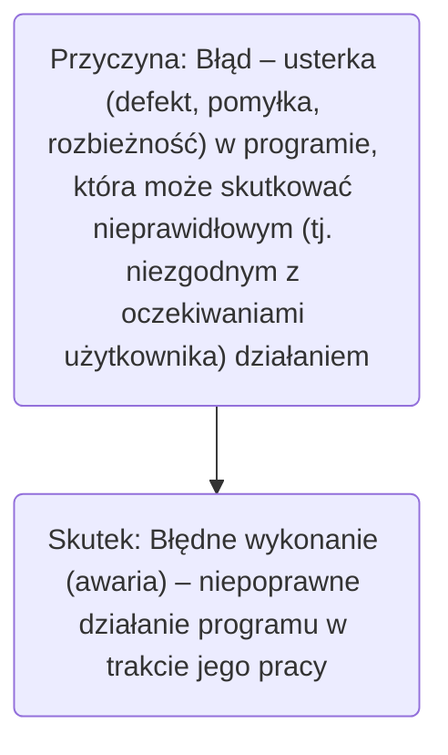
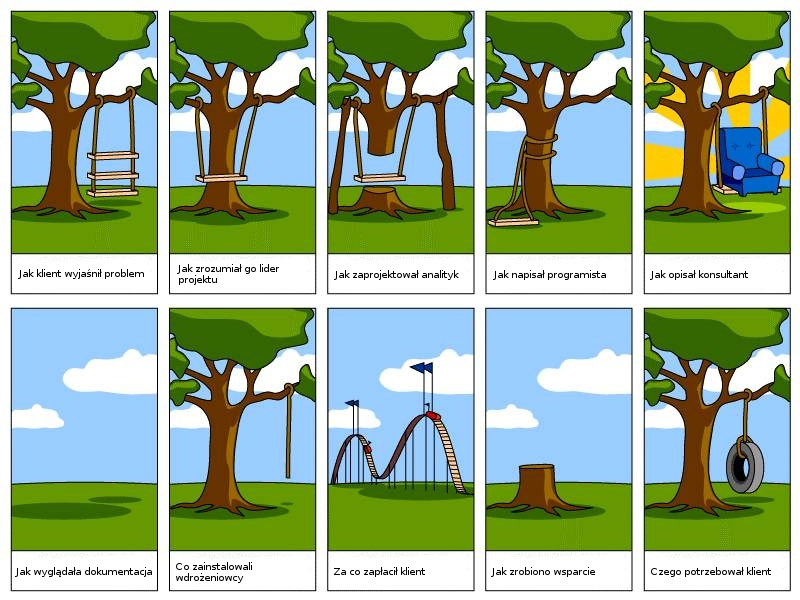

# Wprowadzenie do testowania

 - Skutkiem błędu w programie może być wiele jego błędnych wykonań 
 - Takie samo błędne wykonanie programu może być skutkiem różnych błędów

 ## Najbardziej spektakularne błędy w programach oraz ich skutki
  - 1988: Zestrzelenie samolotu Airbus A320 – śmierć 290 osób 
  - 1991: Błąd naprowadzania rakiet Patriot – śmierć 28 osób 
  - 1994: Błąd dzielenia zmiennoprzecinkowego w procesorze Pentium – koszt ok. 475 000 000 USD 
  - 1996: Katastrofa rakiety Ariane5 – koszt ok. 500 000 000 USD 
  - 1999: Katastrofa sondy kosmicznej Mars Polar Lander 5 – koszt samego lądownika ok. 120 000 000 USD 
  - 2000: „pluskwa milenijna”

## Kiedy w oprogramowaniu znajduje się błąd? 
 - Oprogramowanie nie wykonuje czegoś, co według specyfikacji powinno wykonywać 
 - Oprogramowanie robi coś, czego według specyfikacji nie powinno robić 
 - Oprogramowanie wykonuje coś, o czym specyfikacja w ogóle nie wspomina 
 - Oprogramowanie nie wykonuje czegoś, o czym specyfikacja nie wspomina, ale powinna 
 - Oprogramowanie jest trudne do zrozumienia, trudne do użycia, powolne albo – zdaniem testera – będzie w oczach użytkownika po prostu nieprawidłowe

 ## Źródła powstawania błędów, udział od największych do najmniejszych
  - Specyfikacja,
  - Projekt,
  - Kod,
  - Inne.

Istotnymi czynnikami mającymi wpływ na powstawanie błędów wprogramach jest ich rosnąca złożoność i wielkość.

## Kontekst i zrozumienie

## Błędy w programie można rozpatrywać na poziomie: 
 - mechanizmu powstawania błędu (error), związanego najczęściej zfazą analizy wymagań i projektowania (błędne założenia projektowe, niewłaściwa interpretacja specyfikacji, dobór niewłaściwego algorytmu, itp.) 
 - programowym (fault), związanym najczęściej z fazą implementacji (błędy programisty)
 - użytkowym ( failure ), kiedy można zaobserwować błędne działanie funkcji program

## Szacunkowe koszty błędów

Dynamiczny rozwój branży IT powoduje obserwowalne i rosnące koszty będące skutkami błędów w programach

| Faza           | Koszt [EUR] | czas naprawy [h] |
| ---            |  ------     | ---------:       |
| Analiza        | 1           | 0.1              |
| Projektowanie  | 5           | 0.5              |
| Kodowanie      | 10          | 1                |
| Testowanie     | 15-50       | 1.5-5            |
| Wdrożenie      | >100        | >10              |

## Czy testowanie się opłaca?
 - Scenariusz #1: 
   - Liczba błędów znalezionych w programie – 1000 
   - Liczba błędów znalezionych przez deweloperów – 750 
   - Liczba błędów znalezionych przez użytkowników – 250 
   - Średni koszt wykrycia i naprawy błędu: przed wdrożeniem – 10, po wdrożeniu – 250
   - Koszt zapewnienia jakości: 750 * 10€ + 250 * 250€ = 70 000€
 - Scenariusz #2:
   - Liczba błędów znalezionych w programie – 1000 
   - Liczba błędów znalezionych przez deweloperów – 750 
   - Liczba błędów znalezionych przez testerów – 200 
   - Liczba błędów znalezionych przez użytkowników – 50 
   - Średni koszt wykrycia i naprawy błędu: przed testowaniem – 10, w fazie testowania – 50, po wdrożeniu – 250
   - Koszt przygotowania i przeprowadzenia testów – 10 000
   - Koszt zapewnienia jakości: 750 * 10€ + 200 * 50€ + 50 * 250€ + 10 000€ = 40 000€
- Wniosek: Naprawa błędnego oprogramowania jest droższa (finansowoi marketingowo) niż koszt pracy testerów

# Literatura
 - Ron Patton, Testowanie oprogramowania, MIKOM, 2002
 - Glenford J. Myers, et al, Sztuka testowania oprogramowania, Helion, 2005
 - Dick Hamlet, Joe Maybee, Podstawy techniczne inżynierii oprogramowania, WNT, 2003
 - Robert V. Binder, Testowanie systemów obiektowych. Modele, wzorce, narzędzia, WNT, 2003 
 - Janusz Sosnowski, Testowanie i niezawodność systemów komputerowych, EXIT, 2005 
 - Kent Beck, Test-Driven Development by example , AddisonWesley Professional, 2003