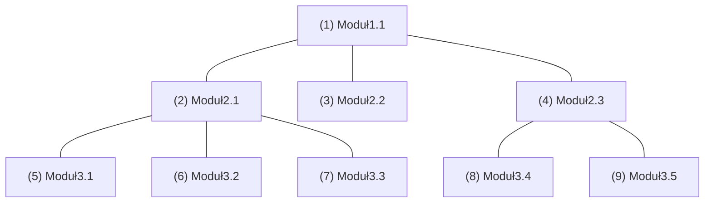
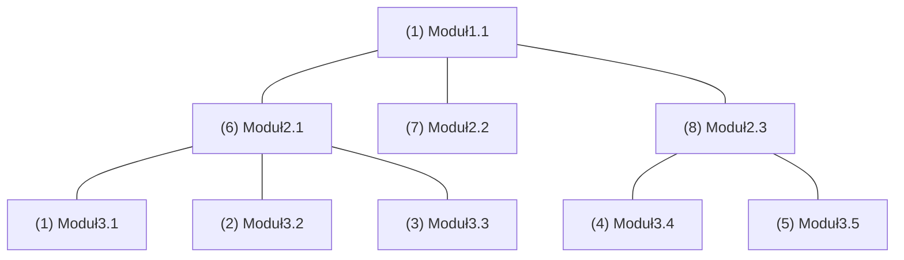

<!-- TOC -->

- Wprowadzenie do testowania
    - Najbardziej spektakularne błędy w programach oraz ich skutki
    - Kiedy w oprogramowaniu znajduje się błąd? 
    - Źródła powstawania błędów, udział od największych do najmniejszych
    - Kontekst i zrozumienie
    - Źródła i rodzaje błędów
    - Szacunkowe koszty błędów
    - Czy testowanie się opłaca?
    - Podstawowe pojęcia
    - Podstawowe zasady
- Walidacja i weryfikacja oprogramowania
    - Weryfikacja dynamiczna
    - Cele testowania
- Model V
- Aksjomaty testowania
    - Nawet najprostszego programu nie da się przetestować całkowicie (wyczerpująco)
    - Testowanie oprogramowania jest ryzykowne
    - Im więcej błędów zostało znalezionych, tym więcej błędów pozostaje jeszcze nieznalezionych
    - Nie wszystkie znalezione błędy zostaną naprawione
    - Trudno jest zawsze jednoznacznie określić, co jest, a co nie jest błędem
- Warunki wykrycia błędu
- Dokumentowanie błędnego wykonania
- Metodyka testowania oprogramowania
    - Podział testów
        - Podział testów ze względu na sposób ich przeprowadzenia
        - Podział testów ze względu na zakres testowania
        - Podział testów ze względu na ich przeznaczenie
    - Strategie testowania
        - Testowanie funkcjonalne (black-box)
            - Klasy równoważności
            - Wartości brzegowe
            - Tablice przejść stanów
            - Tablice decyzyjne i grafy przyczynowo-skutkowe
            - Przypadki użycia
            - Kontrola składni
            - Kombinacje par parametrów
            - Losowy dobór danych
            - Podsumowanie (black-box)
        - Testowanie strukturalne (white-box)
            - Analiza przepływu danych
            - Analiza pokrycia kodu
                - Pokrycie wyrażeń
                - Pokrycie rozgałęzień
                - Pokrycie ścieżek
                - Pokrycie decyzji
                - Pokrycie warunków logicznych
            - Podsumowanie (white-box)
        - Testowanie oparte na doświadczeniu
            - Podsumowanie (doświadczenie) 
- Testowanie jednostkowe
    - Cechy testowania jednostkowego
- Testowanie mutacyjne/różnicowe
- Testowanie integracyjne
    - Metoda zstępująca (top-down)
    - Metoda wstępująca (bottom-up)
    - Podsumowanie (testowanie integracyjne)
- Testowanie systemowe
- Testy akceptacyjne
- Niezawodność oprogramowania
- Literatura

<!-- /TOC -->

# 1. Wprowadzenie do testowania


 - Skutkiem błędu w programie może być wiele jego błędnych wykonań 
 - Takie samo błędne wykonanie programu może być skutkiem różnych błędów

## 1.1. Najbardziej spektakularne błędy w programach oraz ich skutki
  - 1988: Zestrzelenie samolotu Airbus A320 – śmierć 290 osób 
  - 1991: Błąd naprowadzania rakiet Patriot – śmierć 28 osób 
  - 1994: Błąd dzielenia zmiennoprzecinkowego w procesorze Pentium – koszt ok. 475 000 000 USD 
  - 1996: Katastrofa rakiety Ariane5 – koszt ok. 500 000 000 USD 
  - 1999: Katastrofa sondy kosmicznej Mars Polar Lander 5 – koszt samego lądownika ok. 120 000 000 USD 
  - 2000: „pluskwa milenijna”

## 1.2. Kiedy w oprogramowaniu znajduje się błąd? 
 - Oprogramowanie nie wykonuje czegoś, co według specyfikacji powinno wykonywać 
 - Oprogramowanie robi coś, czego według specyfikacji nie powinno robić 
 - Oprogramowanie wykonuje coś, o czym specyfikacja w ogóle nie wspomina 
 - Oprogramowanie nie wykonuje czegoś, o czym specyfikacja nie wspomina, ale powinna 
 - Oprogramowanie jest trudne do zrozumienia, trudne do użycia, powolne albo – zdaniem testera – będzie w oczach użytkownika po prostu nieprawidłowe

## 1.3. Źródła powstawania błędów, udział od największych do najmniejszych
  - Specyfikacja,
  - Projekt,
  - Kod,
  - Inne.

Istotnymi czynnikami mającymi wpływ na powstawanie błędów wprogramach jest ich rosnąca złożoność i wielkość.

## 1.4. Kontekst i zrozumienie


## 1.5. Źródła i rodzaje błędów
Błędy w programie można rozpatrywać na poziomie: 
 - mechanizmu powstawania błędu (error), związanego najczęściej z fazą analizy wymagań i projektowania (błędne założenia projektowe, niewłaściwa interpretacja specyfikacji, dobór niewłaściwego algorytmu, itp.) 
 - programowym (fault), związanym najczęściej z fazą implementacji (błędy programisty)
 - użytkowym (failure), kiedy można zaobserwować błędne działanie funkcji program

## 1.6. Szacunkowe koszty błędów

Dynamiczny rozwój branży IT powoduje obserwowalne i rosnące koszty będące skutkami błędów w programach


| Faza           | Koszt [EUR] | czas naprawy [h] |
| ---            |  ------     | ---------:       |
| Analiza        | 1           | 0.1              |
| Projektowanie  | 5           | 0.5              |
| Kodowanie      | 10          | 1                |
| Testowanie     | 15-50       | 1.5-5            |
| Wdrożenie      | >100        | >10              |

## 1.7. Czy testowanie się opłaca?
 - Scenariusz #1: 
   - Liczba błędów znalezionych w programie – 1000 
   - Liczba błędów znalezionych przez deweloperów – 750 
   - Liczba błędów znalezionych przez użytkowników – 250 
   - Średni koszt wykrycia i naprawy błędu: przed wdrożeniem – 10€, po wdrożeniu – 250€
   - Koszt zapewnienia jakości: 750 * 10€ + 250 * 250€ = 70 000€
 - Scenariusz #2:
   - Liczba błędów znalezionych w programie – 1000 
   - Liczba błędów znalezionych przez deweloperów – 750 
   - Liczba błędów znalezionych przez testerów – 200 
   - Liczba błędów znalezionych przez użytkowników – 50 
   - Średni koszt wykrycia i naprawy błędu: przed testowaniem – 10€, w fazie testowania – 50€, po wdrożeniu – 250€
   - Koszt przygotowania i przeprowadzenia testów – 10 000
   - Koszt zapewnienia jakości: 750 * 10€ + 200 * 50€ + 50 * 250€ + 10 000€ = 40 000€
- Wniosek: Naprawa błędnego oprogramowania jest droższa (finansowoi marketingowo) niż koszt pracy testerów

## 1.8. Podstawowe pojęcia
 - Testowanie oprogramowania to wykonanie kodu dla różnych kombinacji danych wejściowych i stanów, mające na celu wykrycie błędów w programie
 - Zasadniczym celem testowania jest dążenie do uzyskania odpowiednio wysokiego poziomu niezawodności i jakości oprogramowania, stosownie do zdefiniowanych wymagań, ograniczeń czasowych i kryteriów ekonomicznych
 - Testowanie powinno umożliwiać wykrycie jak największej liczby błędów → wzrost niezawodności programu
 - Testowanie powinno zapewniać na jak najwcześniejsze wykrycie błędów → redukcja kosztów naprawy błędów
 - Test zakończony sukcesem to test, którego skutkiem jest wykrycie nieznalezionego dotychczas błędu w programie 
 - Test uznaje się za efektywny, jeżeli ma zdolność wykrycia jaknajwiększej liczby błędów zjak największym prawdopodobieństwem
 - Uruchamianie programów („odpluskwianie”, debugowanie) jest działaniem mającym na celu zlokalizowanie, a następnie poprawienie wykrytych w trakcie testowania błędów 
 - Do uruchamiania programów wykorzystuje się przypadki testowe zaprojektowane w taki sposób, aby były pomocne wznajdowaniu przyczyny błędu 
 - Uruchamianie programów jest procesem, w trakcie którego formułuje się, a następnie weryfikuje praktycznie hipotezy, dotyczące przyczyn błędnego działania programu 
 - W trakcie debugowaniabardzo pomocne jest doświadczenie iwiedza, dotycząca typowych błędów programistycznych

## 1.9. Podstawowe zasady
  - podczas testowania ważniejsze jest sprawdzenie typowych przypadków użycia programu, niż przypadków rzadkich (skrajnych) 
  - testowanie istniejącej funkcjonalności programu powinno być ważniejsze od testowania nowej funkcjonalności 
  - należy unikać testowania przez autorów oprogramowania 
  - należy dokumentować testy i zasady ich użycia 
  - należy zbierać i poddawać analizie wyniki testów 
  - trzeba uwzględniać w testach zarówno poprawne, jak i niepoprawne dane wejściowe oraz warunki wykonania 
  - należy sprawdzać, nie tylko czy w trakcie działania program wykonuje to co powinien, ale także czy nie wykonuje tego, czego nie powinien

# 2. Walidacja i weryfikacja oprogramowania

 - Atestowanie, walidacja (validation) jest sprawdzaniem zgodności działania programu z oczekiwaniami użytkownika w rzeczywistych warunkach i w środowisku, dla których został on zaprojektowany Walidacja zajmuje się wykrywaniem błędów związanych znieprawidłową specyfikacją wymagań
 - Weryfikacja (verification) jest procesem mającym na celu sprawdzenie, czy program na danym etapie wytwarzania jest zgodny z wymaganiami i oczekiwaniami użytkownika Weryfikacja nie zajmuje się wykrywaniem błędów związanych z nieprawidłową specyfikacją wymagań

 - Walidacja stara się odpowiedzieć na pytanie: „Czy budujemy prawidłowy produkt?” i w tym sensie dotyczy całościowej oceny programu pod kątem spełniania oczekiwań użytkownika
 - Weryfikacja natomiast stara się odpowiedzieć na pytanie: „Czy prawidłowo budujemy produkt?” i obejmuje szerszy zakres zagadnień niż testowanie
 - Zarówno weryfikacja, jak i walidacja powinny być wykonywane na każdym etapie tworzenia oprogramowania

 - Weryfikacja może mieć charakter: 
   - statyczny – związany z analizą (przeglądem, inspekcją) specyfikacji, projektu lub kodu programu (bez konieczności jego uruchamiania) 
   - dynamiczny – polegający na wykonaniu programu lub jego fragmentu  z danymi testowymi i porównaniu uzyskanych wyników z wynikami poprawnymi → testowanie oprogramowania
 - Typową techniką statycznej weryfikacji są inspekcje kodu, podczas których zespoły inspekcyjne dokonują przeglądu kodu pod kątem sprawdzenia jego poprawności oraz spełnienia dodatkowych kryteriów (prostota, poprawność zastosowanych konstrukcji programistycznych, zgodność ze standardami kodowania, …)

 - Inną formą statycznej weryfikacji kodu jest zastosowanie narzędzi do automatycznej analizy kodu Tego typu analizatory przeglądają kod źródłowy analizując jego składnię, np. w celu sprawdzenia poprawności użytych konstrukcji programistycznych, czy też wnioskowania oprzepływie sterowania w programie. Automatyczne analizatory kodu bazują na metodach formalnych, które dla wielu systemów generują bardzo wysokie koszty, a ponadto nie są w stanie poradzić sobie ztrudnościami podczas definiowania wymagań

## 2.1. Weryfikacja dynamiczna
Weryfikacja dynamiczna – testowanie kodu programu lub jego fragmentu


 - Kod poddawany testowaniu to: 
   - implementacja testowana – IUT (Implementation Under Test) 
   - metoda testowana – MUT (Method Under Test) 
   - obiekt testowany – OUT (Object Under Test) 
   - klasa testowana – CUT (Class Under Test) 
   - składowa testowana – CUT (Component Under Test) 
   - system testowany – SUT (System Under Test)
 - Przypadek testowy (Test case) – specyficzny zestaw danych wejściowych, warunków początkowych oraz oczekiwanych wyników iwarunków końcowych, służący do testowania kodu programu

 - Typowe aktywności związane z weryfikacją: 
   - sprawdzanie, czy wymagania użytkownika są weryfikowalne
   - sprawdzanie, czy elementy składowe projektu są weryfikowalne zgodnie z wymaganiami użytkownika
   - testowanie jednostek oprogramowania (modułów)
   - testowanie modułów po ich integracji
   - testowanie programu przez jego twórców
   - testowanie akceptacji programu przez użytkowników
   - okresowe inspekcje i przeglądy
   - audyt (kontrola jakości)

 - Testowanie jest jedyną techniką walidacji w odniesieniu do wymagań niefunkcjonalnych, takich jak np. rozszerzalność, bezpieczeństwo, wydajność czy skalowalność systemu
 - Przeglądy wymagań ( reviews ) są najbardziej efektywną metodą walidacji wymagań
 - Aby osiągnąć zadowalający poziom weryfikacji i walidacji, konieczne jest stosowanie zarówno techniki statycznej weryfikacji, jak i testowania, wykorzystującego odpowiednio adekwatny zestaw przypadków testowych

## 2.2. Cele testowania
 - Ostatecznym celem weryfikacji i walidacji nie jest sprawdzenie, czy kod programu jest wolny od błędów, leczczy będzie on spełniał swoje funkcje i nadawał się dowykorzystania przez użytkownika
 - Osiągnięcie tak zdefiniowanego celu można utożsamiać zuzyskaniem odpowiedniego poziomu pewnościdziałania programu
 - Poziom pewności zależy przede wszystkim od:
   - przeznaczenia oprogramowania (stopnia krytyczności)
   - oczekiwań użytkowników
   - uwarunkowań na rynku

# 3. Model V

 - Model V definiuje podstawowe fazy testowania systemu oraz pokazuje ich zależność z fazami projektowania systemu
 - Podstawowe fazy testowania systemu:
   - testowanie modułów – testowanie najmniejszych jednostek kodu, realizowane bezpośrednio po zakończeniu ich implementacji
   - testowanie systemu – testowanie poszczególnych podsystemów oraz systemu jako całości, realizowane po zintegrowaniu modułów składowych
   - testowanie akceptacji użytkowników – oprogramowanie poddawane jest testowaniu przez przyszłego użytkownika lub niezależny od producenta zespół testowy (testy alfa, testy beta)


# 4. Aksjomaty testowania
Testowanie w żaden sposób nie jest w stanie wykazać, że oprogramowanie nie zawiera błędów, a także nie jest w stanie udowodnić, że program będzie zawsze prawidłowo realizował swoje funkcje.

>>>
„Testing shows the presence, not the absence of bugs” Edsger W. Dijkstra
>>>

## 4.1. Nawet najprostszego programu nie da się przetestować całkowicie (wyczerpująco)

Przyczyny:
 - ogromna liczba danych wejściowych i wyjściowych
 - ogromna liczba możliwych ścieżek wykonania kodu programu
 - specyfikacja wymagań jest często subiektywna i ocena, czy program działa prawidłowo czy nie, zależy od tego, kto ten program ocenia (użytkownik, obserwator, tester)
 - definicje miar jakości są subiektywne i często trudno mierzalne

Przykład #1:
```
double sum(int a, int b)
```

Zakładając, że typ int jest 32-bitowy, ile mamy kombinacji danych wejściowych?

(0, 0), (0, 1), (0, 2), . . ., (0, 2<sup>32</sup>-1),

(1, 0), (1, 1), (1, 2), . . ., (1, 2<sup>32</sup>-1),

(2, 0), (2, 1), (2, 2), . . ., (2, 2<sup>32</sup>-1),

. . .

 (2<sup>32</sup>-1, 0), (2<sup>32</sup>-1, 1), (2<sup>32</sup>-1, 2), . . ., (2<sup>32</sup>-1, 2<sup>32</sup>-1)

Odpowiedź: 2<sup>64</sup> = ~1.8 * 10<sup>19</sup> (zakładając testowanie z szybkością 1test/s, to testowanie zajęłoby ok. 500 miliardów lat)  

Przykład #2
```
for (int i = 0; i < n; i++) {
    if (tab[i] == i % 2) {
        tab[i]++; 
    } else {
        tab[i] = 0;
    }
}
```

Ile potrzeba testów, aby sprawdzić wszystkie ścieżki wykonania kodu?

n = 1 → 3 ścieżki, n = 2 → 5 ścieżek, n = 5 → 33 ścieżki,

n = 10 → 1025 ścieżek, n = 100 → ~1.3 * 10<sup>30</sup> ścieżek, . . .

Odpowiedź: 2<sup>n</sup>+1 → zależność wykładnicza!!!

## 4.2. Testowanie oprogramowania jest ryzykowne

Skoro nie da się przetestować wszystkiego, to trzeba pójść na kompromis i wybrać nieduży, lecz reprezentatywny podzbiór danych do testowania Podejmujemy jednocześnie ryzyko, że nie będziemy w stanie wykryć takiego błędu, który objawi się wyłącznie dla takiej kombinacji danych wejściowych, której nie testujemy
Ile testów potrzeba, aby wykryć jak największą liczbę błędów,zachowując jednocześnie koszty testowania na akceptowalnym poziomie?


## 4.3. Im więcej błędów zostało znalezionych, tym więcej błędów pozostaje jeszcze nieznalezionych

Błędy programistyczne wykazują tendencję do występowania w grupach, co oznacza, że szczególną uwagę należy poświęcać tym fragmentom kodu, w których już wcześniej wykryto jakieś błędy

Przyczyny: 
 - błędy popełniane przez programistę w trakcie pracy zależą od jego sprawności (kondycji) psychicznej, samopoczucia, itp. 
 - programiści często powtarzają te same błędy
 - niektóre fragmenty kodu są bardziej podatne na błędy niż inne


## 4.4. Nie wszystkie znalezione błędy zostaną naprawione

Wykrycie błędu nie oznacza, że automatycznie zostanie on poprawiony

Przyczyny:
 - brak czasu (są inne ważniejsze zadania do wykonania) 
 - menadżerowie zarządzający projektem mogą podjąć inną decyzję (napięty harmonogram, zbyt duże koszty naprawy) 
 - zbyt duże ryzyko związane z koniecznością wprowadzenia bardzo istotnych zmian w oprogramowaniu 
 - nieopłacalność (błąd ujawnia się bardzo rzadko, ma niską „szkodliwość”, można go w prosty sposób ominąć)

## 4.5. Trudno jest zawsze jednoznacznie określić, co jest, a co nie jest błędem

Czy błąd, którego skutków nie można zaobserwować pozostaje błędem? Czy zawsze obserwowane zachowanie programu będzie przez wszystkich obserwatorów (programistów, testerów, użytkowników) zinterpretowane w taki samsposób (jakodziałanie prawidłowe albo błędne)?

# 5. Warunki wykrycia błędu
 - Dobrze zaprojektowany test powinien wykrywać jak największą liczbę błędów
 - Aby wykryć błąd konieczne jest spełnienie trzech warunków: 
   - osiągalności miejsca błędu (reachability) – dane testowe powinny być tak dobrane, aby spowodować wykonanie instrukcji zawierającej błąd 
   - uczulenia błędu (necessity) – dane testowe powinny być tak dobrane, aby wykonanie instrukcji zawierającej błąd, spowodowało błędne wykonanie 
   - propagacji efektu błędu (propagation) – efekt błędu powinien zostać zaobserwowany, tzn. musi mieć wpływ na wynik działania programu
  - Spełnienie powyższych trzech warunków często nazywane jest warunkiem detekcji błędu (ideal fault condition)

Przykład:
```
if (x >= 0) {
  y = x * x;  // błąd – powinno być: y = x + x;
} else {
  y = 0;
}
returny >= 8;
```
x < 0 → brak osiągalności błędu

x = 0 lub x = 2 → brak uczulenia błędu

x >= 4 → brak propagacji (obserwowalności) efektu błędu

# 6. Dokumentowanie błędnego wykonania
Każde błędne wykonanie programu powinno zostać udokumentowane przez:
 - podanie stanu początkowego wraz z sekwencją kroków, które doprowadziły do zaobserwowania błędnego wykonania programu
 - określenie, czy podana sekwencja kroków jest minimalna
 - podanie alternatywnych sekwencji kroków, dających taki sam obserwowalny skutek 
 - określenie w miarę podobnych sekwencji kroków, które nie powodują błędnego wykonania programu
 - opis środowiska, w którym uruchamiany był program
 - listę obserwacji skutków błędu (np. uszkodzonych danych)
 - opis konsekwencji błędu dla użytkownika

# 7. Metodyka testowania oprogramowania
Elementy systematycznej metodyki procesu testowania:
 - określenie przesłanek i wymagań dotyczących generowanych testów
 - wybór strategii testowania
 - projektowanie testów (opracowanie i weryfikacja specyfikacji testów)
 - planowanie procesu testowania
 - wzbogacanie testów poprzez inspekcję kodu
 - wybranie (ewentualnie opracowanie) narzędzi wspomagających testowanie
 - implementacja testów
 - dokumentowanie testowania
 - ocena testów, identyfikowanie pominiętych przesłanek testowania wcelu udoskonalenia testów

## 7.1. Podział testów
Testowanie możemy podzielić ze względu na
 - sposób przeprowadzania testowania
 - zakres testowania
 - przeznaczenie testowania

### 7.1.1. Podział testów ze względu na sposób ich przeprowadzenia
 - manualnie – przez testera wykonującego zaplanowaną sekwencję operacji
 - automatycznie – za pomocą odpowiednich narzędzi (testing framework), pozwalających na uruchomienie napisanych testów lub odtworzenie testów uprzednio nagranych

### 7.1.2. Podział testów ze względu na zakres testowania
 - testy specyfikacji (specification testing) – pozwalają sprawdzić statycznie poprawność opracowanych lub dostarczonych specyfikacji (wymagań,danych, projektu)
 - testy modułów, testy jednostkowe (unit testing) – testują one system na poziomie pojedynczych funkcji (metod) 
 - testy integracyjne (integration testing) – pozwalają sprawdzić poprawność współpracy różnych komponentów składowych systemu
 - testy systemowe (system testing) – dotyczą testowania aplikacji jako całości, zwłaszcza w kontekście weryfikacji specyfikacji wymagań
 - testy akceptacyjne (acceptance testing) – służą do oceny zgodności działania programu z wymaganiami użytkownika

### 7.1.3. Podział testów ze względu na ich przeznaczenie
 - testy funkcjonalne (functional testing) – pozwalają ocenić, czy oprogramowanie działa zgodnie ze specyfikacją
 - testy regresyjne (regression testing) – służą do sprawdzenia, czy wprowadzone w kodzie modyfikacje bądź zmiany w środowisku, nie skutkują powstaniem nowych błędów lub ujawnieniem się błędów dotychczas niewykrytych
 - testy przenaszalności/testy konfiguracji (portability/configuration testing) – pozwalają ocenić, czy oprogramowanie będzie działać na różnych platformach sprzętowych lub systemach operacyjnych
 - testy post-awaryjne (disaster recovery testing) – służą ocenie zachowania aplikacji po wystąpieniu sytuacji awaryjnej
 - testy bezpieczeństwa (safety testing) – służą ocenie bezpieczeństwa aplikacji

## 7.2. Strategie testowania
 - Przed rozpoczęciem testowania konieczne jest przyjęcie pewnych założeń dotyczących wyboru strategii (koncepcji) testowania programu i projektowania przypadków testowych
 - Najczęściej stosowane strategie testowania:
   - testowanie funkcjonalne, zwane także testowaniem metodą „czarnej skrzynki” (black-box testing), testowaniem sterowanym danymi (data-driven testing) lub testowaniem wejścia-wyjścia (input/output testing)
   - testowanie strukturalne, zwane także testowaniem metodą „białej skrzynki” (white-box testing), metodą „szklanej skrzynki” (glass-box testing) lub testowaniem sterowanym logiką (logic-driven testing)
   - testowanie oparte na doświadczeniu (experience-based testing) 

### 7.2.1. Testowanie funkcjonalne (black-box)
 - Podstawowym założeniem testowania funkcjonalnego jest znajomość wymagań dla testowanej funkcjonalności 
 - System traktowany jest jak „czarna skrzynka”, o której nic nie wiemy, a testowanie polega na wprowadzeniu na jej wejście danych testowych i porównaniu otrzymanych wyników zdanymi oczekiwanymi


Techniki testowania funkcjonalnego wykorzystują:
 - podział na klasy równoważności (equivalence partitioning)
 - analizę wartości brzegowych (boundary value analysis)
 - tablice przejść stanów (state transition testing)
 - tablice decyzyjne (decision table testing) lub grafy przyczynowoskutkowe (cause-effect graphs)
 - przypadki użycia (use case testing)
 - kontrolę składni (syntax testing)
 - kombinacje par parametrów wejściowych (pairwise testing)
 - losowy lub pseudo-losowy dobór danych testowych (random testing) 

#### 7.2.1.1. Klasy równoważności
Technika oparta na podziale na klasy równoważności zakłada podział dziedziny wartości danych wejściowych na skończoną liczbę podzbiorów (klas równoważności) w taki sposób, aby:
 - program zachowywał się analogicznie dla wszystkich wartości danych z tej samej klasy
 - zastąpienie testowania wszystkich wartości danych z klasy równoważności przez testowanie pojedynczej (reprezentatywnej) wartości danej z tej klasy, pozwalało na wykrycie błędu z takim samymp rawdopodobieństwem
 
Przypadki testowe projektuje się tak, aby pokrywały wszystkie możliwe scenariusze

Przykład:
>>>
„Oddział banku umożliwia podjęcie pieniędzy z rachunku klienta po okazaniu dowodu osobistego. Wypłata kwoty przekraczającej 1000 złotych wymaga weryfikacji stanu konta klienta. Kwoty wypłat przekraczające 50 000 złotych muszą zostać dodatkowo zatwierdzone przez kierownika placówki.”
>>>

Przypadki testowe: -10.00, 100.00, 1 200.00, 55 000.00

#### 7.2.1.2. Wartości brzegowe
Technika oparta na analizie wartości brzegowych bada zachowanie programu dla brzegowych (granicznych) wartości danych wejściowych oraz „w pobliżu” wartości rozgraniczających klasy równoważności, wychodząc z założenia, że prawdopodobieństwo wystąpienia błędnego wykonania programu dla takich właśnie wartości jest dużo większe niż dla wartości „ze środka” klas równoważności

Przypadki testowe: -0.01, 0.00, 0.01, 999.99, 1 000.00, 1 000.01, 49 999.99, 50 000.00, 50 000.01

#### 7.2.1.3. Tablice przejść stanów
Technika wykorzystująca tablice przejść między stanami służy do testowania systemów wyspecyfikowanych lub modelowanych jako maszyna stanowa Przypadki testowe projektuje się tak, aby sprawdzały osiągalność poszczególnych stanów, a także dozwolone orazniedozwolone przejścia między stanami 

Przykład


| stan/pobudzenie | 0  | 1  |
| ---             | -- | -- |
| S1              | S1 | S2 |
| S2              | S2 | S1 |

#### 7.2.1.4. Tablice decyzyjne i grafy przyczynowo-skutkowe
Technika wykorzystująca tablice decyzyjne lub grafy przyczynowo-skutkowe bada zachowanie programu dla różnych kombinacji logicznych warunków wejściowych (decyzji logicznych). Podejście to wymaga ujęcia specyfikacji działania programu jako logicznej sieci kombinatorycznej, przedstawionej albo bezpośrednio w postaci tablicy decyzyjnej, albo w postaci grafu przyczynowo-skutkowego, który następnie przekształca się w równoważną mu tablicę decyzyjną, wykorzystując tzw. technikę śledzenia wstecznego.

#### 7.2.1.5. Przypadki użycia
Technika wykorzystująca przypadki użycia lub scenariusze zastosowania pozwala na tworzenie przypadków testowych na podstawie informacji o programie z punktu widzenia użytkownika. Przypadki użycia opisują interakcje między aktorami a systemem (sekwencje działań użytkowników mające określony cel biznesowy) i są użyteczne do sprawdzania poprawności działania programu, związanego z typowymi aktywnościami użytkowników (badanie przepływów, warunków początkowych i końcowych)

#### 7.2.1.6. Kontrola składni
Technika wykorzystująca kontrolę składni jest użyteczna do projektowania przypadków testowych na podstawie definicji dziedziny danych wejściowych i/lub dziedziny danych wyjściowych. Kontrolę składni stosuje się najczęściej do weryfikowania poprawności danych złożonych (łańcuchy znaków, formaty plików, struktury rekordów), dla których można zdefiniować formalne reguły sprawdzania ich poprawności, np. w postaci gramatyk formalnych, wyrażeń regularnych, itp. 

#### 7.2.1.7. Kombinacje par parametrów
Technika wykorzystująca kombinacje par parametrów wejściowych zakłada taki sposób projektowania przypadków testowych, aby przetestować wszystkie możliwe, dyskretne kombinacje każdej pary parametrów wejściowych. Najprostsze błędy w programie są najczęściej związane z przetwarzaniem pojedynczego parametru; drugą najczęściej występującą przyczyną najprostszych błędów są nieprawidłowe interakcje pomiędzy parami parametrów wejściowych, które można wykryć stosując tę technikę. Technika ta stanowi alternatywę dla testowania losowego oraz testowania wyczerpującego dla niewielkich problemów

#### 7.2.1.8. Losowy dobór danych
Technika oparta na losowym (pseudo-losowym) doborze danych testowych wykorzystuje pseudolosowy algorytm generujący ciąg danych na podstawie pewnej uprzednio przygotowanej sekwencji lub rozkładu wartości. Podejście to jest wykorzystywane do testowania wymagań niefunkcjonalnych takich, jak wydajność lub niezawodność.
Odmianą tego typu podejścia w odniesieniu do interfejsu użytkownika jest tzw. „małpie testowanie” – metoda  testowania programu polegająca na losowym naciskaniu klawiszy oraz losowym poruszaniu i klikaniu myszką

#### 7.2.1.9. Podsumowanie (black-box)
 - testy funkcjonalne są powtarzalne
 - testy funkcjonalne nadają się do wielokrotnego użycia
 - testowanie funkcjonalne można stosunkowo łatwo zautomatyzować
 - testowany jest nie tylko sam program, lecz jednocześnie środowisko, w którym się wykonuje
 - nie wszystkie aspekty działania programu można w ten sposób przetestować
 - wyniki testów mogą nie być do końca wiarygodne (niedoszacowanie liczby błędów)
 - przyczyny i lokalizacje odnalezionych błędów nie są znane

### 7.2.2. Testowanie strukturalne (white-box)
 - Podstawowym założeniem testowania strukturalnego jest znajomość sposobu implementacji testowanych funkcji
 - Testy opracowywane są na podstawie wiedzy o kodzie źródłowym (strukturze programu), a testowanie polega na wprowadzeniu na wejście danych testowych i porównaniu otrzymanych wyników zdanymi oczekiwanymi


 - Podstawowym ograniczeniem testów strukturalnych jest to, że nie są one w stanie wykryć błędów wynikających z braku funkcjonalności programu
 - Testowanie strukturalne można podzielić na:
   - testowanie dynamiczne (wymagające uruchomienia programu)
   - testowanie statyczne (nie wymagające uruchomienia programu)
 - Ogólna strategia przeprowadzania większości testów strukturalnych polega na testowaniu istniejącego kodu, aby:
   - każda instrukcja zawarta w kodzie źródłowym została wykonana co najmniej jeden raz
   - niezależnie przetestować każdą funkcję (metodę, procedurę) zdefiniowaną w kodzie źródłowym

Techniki testowania strukturalnego opierają się na analizie:
 - przepływu danych
 - pokrycia kodu
 - strukturalnej kodu

#### 7.2.2.1. Analiza przepływu danych
Polega na sprawdzeniu sposobu przetwarzania danych wejściowych przez poszczególne fragmenty kodu programu (funkcje, moduły). Porównanie wartości wybranych zmiennych programu na różnych etapach przetwarzania, zwartościami oczekiwanymi lub wartościami niedozwolonymi umożliwia wykrycie iprzybliżone zlokalizowanie błędu

#### 7.2.2.2. Analiza pokrycia kodu
 - Analiza służy do projektowania przypadków testowych, przeznaczonych do testowania wewnętrznej struktury programu w taki sposób, aby były one w stanie wykonać jak największą część testowanego kodu
 - Analiza pokrycia kodu może być przeprowadzana z użyciem:
   - programów śledzących (debugerów), pozwalających obserwować, które instrukcje kodu są wykonywane w trakcie przetwarzania danych testowych
   - analizatorów pokrycia kodu, które automatyzują proces zbierania informacji o pokryciu kodu przez poszczególne testy, wyświetlają szczegółowe statystyki dotyczące testowania oraz pozwalają na uzyskanie informacji, która część kodu nie została pokryta przez zastosowane testy
 - Stopień pokrycia kodu jest miarą oceny jakości zestawu testów, pozwalającą na:
   - oszacowanie, czy program został przetestowany w wystarczającym stopniu
   - znalezienie minimalnego podzbioru testów (np. do testowania regresyjnego
 - Podstawowe kryteria projektowania testów pokrycia kodu:
   - pokrycie wyrażeń (statement coverage)
   - pokrycie rozgałęzień (branch coverage)
   - pokrycie ścieżek (path coverage)
   - pokrycie decyzji (decision coverage)
   - pokrycie warunków logicznych (branch condition coverage)


##### 7.2.2.2.1. Pokrycie wyrażeń
Test pokrycia wyrażeń (instrukcji programu) polega na takim doborze danych testowych, aby każda instrukcja wynikająca z grafu sterowania została wykonana co najmniej jeden raz. Tego typu testowanie nie bierze pod uwagę zależności instrukcji sterujących (pętle, instrukcje warunkowe, instrukcje wyboru) od przetwarzanych danych i dlatego uzyskanie w nim 100% pokrycia (tj. wykonanie każdej instrukcji programu) nie oznacza przetestowania wszystkich możliwych ścieżek wykonania programu. Jeżeli każda instrukcja znajduje się w osobnej linii kodu źródłowego, to taki test jest równoważny testowi pokrycia wierszy programu (linii kodu)

Przykład
```
  a = 10;
  if (x > 0 && y < 5) 
    y = a * x;
  else
    y = a – x;
  a += x;
```


Jak dobrać dane testowe (x, y), aby uzyskać jak największe pokrycie instrukcji?

Test TC1: {x = 1 , y = 2} pokrywa instrukcje w liniach: 1, 2, 3 i 6

Test TC2: {x = 0 , y = 0} pokrywa instrukcje w liniach: 1, 2, 4, 5 i 6

Odpowiedź: Testy TC1 i TC2 pozwalają na uzyskanie 100% pokrycia instrukcji

##### 7.2.2.2.2. Pokrycie rozgałęzień

Test pokrycia rozgałęzień polega na takim doborze danych testowych, aby wykonać co najmniej jeden raz każdą krawędź w grafie przepływu sterowania (tzn. zapewnić przejście przez wszystkie możliwe rozgałęzienia wynikające z instrukcji warunkowych, pętli oraz instrukcji wyboru). Każde rozgałęzienie w grafie sterowania traktowane jest w tym teście niezależnie od pozostałych. Wynikiem instrukcji warunkowej i instrukcji pętli są dwa rozgałęzienia, zaś instrukcji wyboru tyle rozgałęzień, ile jest możliwych opcji wyboru. Test pokrycia rozgałęzień stanowi uogólnienie testu pokrycia wyrażeń.

Przykład
```
  a = -1;
  if (x > 0) 
    a = 5;
  if (y < 9)
    a = 0
  else
    a += 10
```


Jakie jest pokrycie rozgałęzień dla testów: TC1: {x = 1, y = 0} i TC2: {x = 5, y = 10}?

Odpowiedź: Testy TC1 i TC2 pozwolą uzyskać 4/5 = 80% pokrycia rozgałęzień (100% pokrycia instrukcji)

Jakie dane testowe pozwolą uzyskać 100% pokrycia rozgałęzień?

##### 7.2.2.2.3. Pokrycie ścieżek
Test pokrycia ścieżek polega na takim doborze danych testowych, aby w miarę możliwości wykonać wszystkie ścieżki w grafie przepływu sterowania od węzła początkowego do określonego węzła końcowego. Ograniczenia badania pokrycia ścieżek: 
 - liczba ścieżek rośnie wykładniczo wraz z liczbą decyzji w programie (rozgałęzień w grafie przepływu sterowania), a w przypadku pętli może być nawet nieskończona 
 - z uwagi na występujące warunki logiczne możliwa jest sytuacja, wktórej nie wszystkie ścieżki będą osiągalne, co uniemożliwia uzyskanie 100% pokrycia ścieżek

Uwzględniając powyższe ograniczenie, kompletny test pokrycia ścieżek zastępuje się najczęściej testowaniem odpowiednio dobranego (reprezentatywnego) podzbioru ścieżek. W przypadku testowania pętli liczbę ścieżek ogranicza się w taki sposób, aby uwzględnić następujące przypadki:
 - żadna iteracja pętli nie zostanie wykonywana
 - zostanie wykonane n iteracji pętli (n - parametr) w taki sposób, aby wszystkie ścieżki wewnątrz pętli zostały co najmniej raz wykonane
 - zostanie wykonana minimalna liczba iteracji, przeciętna liczba iteracji oraz maksymalna liczba iteracji

Test pokrycia ścieżek wykorzystujący podejście LCSAJ ( Linear Code Sequence And Jump ) bierze pod uwagę wszystkie ścieżki bazujące na liniowych sekwencjach kodu, które są definiowane przez trójki punktów w kodzie źródłowym, wskazujące odpowiednio: początek sekwencji instrukcji, koniec tej sekwencji oraz docelową instrukcję, do której będzie przekazane sterowanie. Stopień skomplikowania testowanego fragmentu kodu odzwierciedla tzw. złożoność cyklomatyczna CC (cyclomatic complexity) , która określa liczbę niezależnych ścieżek wprogramie jako d+1, gdzie d jest liczbą binarnych węzłów decyzyjnych.

Przykład 1
```
  if (success) 
    a = 1;
  a++;
  if (success)
    a += 10
```


Jakie największe pokrycie ścieżek można uzyskać dla powyższego fragmentu kodu?

Odpowiedź: Niezależnie od wartości parametru „success” zawsze uzyskamy 2/4 = 50% pokrycia ścieżek.

Przykład 2
```
  a = -1;
  if (x > 0) 
    a = 5;
  if (y < 9)
    a = 0
  else
    a += 10
```


Jakie jest pokrycie ścieżek dla testów: TC1: {x = 1, y = 0} i TC2: {x = 5, y = 10}?

Odpowiedź: Testy TC1 i TC2 pozwolą uzyskać 2/4 = 50% pokrycia ścieżek.

Jakie dane testowe pozwolą uzyskać 100% pokrycia ścieżek?

##### 7.2.2.2.4. Pokrycie decyzji
Test pokrycia decyzji polega na takim doborze danych testowych, aby niezależnie od siebie przetestować warunki logiczne w instrukcjach sterujących. Bez względu na to, czy warunek logiczny jest prosty czy złożony, sposób jego testowania polega na tym, aby jego wynik raz przyjął wartość logicznej prawdy i raz fałszu

Przykład:
```
  if (x >= 1 && y < 5) 
    a = 0;
```

TC1: {x = 0, y = 1}, TC2: {x = 1, y = 1} – 100% pokrycie decyzji

##### 7.2.2.2.5. Pokrycie warunków logicznych
Test pokrycia warunków logicznych polega na takim doborze danych testowych, aby przetestować złożone warunki logiczne w instrukcjach warunkowych. Sposoby testowania złożonych warunków logicznych:
 - prosty test pokrycia warunków – testowany jest każdy warunek elementarny tak, aby raz przyjął wartość logicznej prawdy i raz fałszu
 - test wielokrotnego pokrycia warunków – testowana jest każda możliwa kombinacja wyników warunków elementarnych (dla n warunków elementarnych mamy 2<sup>n</sup> kombinacji)
 - minimalny test wielokrotnego pokrycia warunków – testowany jest podzbiór możliwych kombinacji wyników warunków elementarnych, wynikający z zasady warunkowego obliczania wartości wyrażenia (short circuit evaluation)

 Przykład
 ```
  if (x > 0 || y < 9>)
    a = 5;
 ```
Zaprojektuj dane testowe (x, y), aby uzyskać jak największe pokrycie w:
 1. prostym teście pokrycia warunków
 2. teście wielokrotnego pokrycia warunków
 3. minimalnym teście wielokrotnego pokrycia warunków

Odpowiedź:
 1. TC1: {x = 0, y = 10}, TC2: {x = 1, y = 0} – pokrycie 100%
 2. TC1: {x = 0, y = 10}, TC2: {x = 0, y = 1}, TC3: {x = 2, y = 10},                        TC4: {x = 2, y = 1} – pokrycie 100%
 3. TC1: {x = 0, y = 10}, TC2: {x = 0, y = 1}, TC3: {x = 2, y = 10} – pokrycie 100%

#### 7.2.2.3. Podsumowanie (white-box)
 - testy strukturalne oceniają tylko istniejący kod programu i należy je traktować jako uzupełnienie, a nie zastąpienie testów funkcjonalnych 
 - testy strukturalne pozwalają ustalić przyczynę i lokalizację błędów
 - testy strukturalne mogą być wykorzystane do optymalizacji działania programu
 - testy pokrycia nie oceniają efektywności samych przypadków testowych, lecz służą głównie do oszacowania, jaka część kodu zostałaprzez nie sprawdzona (nawet 100% pokrycie w najbardziej zaawansowanych testach nie gwarantuje poprawności kodu) 
 - znajomość kodu źródłowego może być bardzo użyteczna podczas konstruowania przypadków testowych (np. do ustalenia wartości granicznych testowanych parametrów)

### 7.2.3. Testowanie oparte na doświadczeniu
Testowanie oparte na doświadczeniu jest odmianą testowania strukturalnego, które wykorzystuje wiedzę, intuicję oraz wcześniejsze doświadczenia testera, w celu poszukiwania błędów w programie woparciu o takie kryteria, które niezawszemożna formalnie zdefiniować. Do podstawowych technik testowania, które wykorzystują doświadczenie testera należą:
 - odgadywanie błędów (error guessing)
 - testowanie bazujące na listach kontrolnych (checklist-based)
 - testowanie eksploracyjne (exploratory testing)
 - przeprowadzanie ataków (attacks)

Zgadywanie błędów jest techniką polegającą na takim projektowaniu przypadków testowych, aby sprawdzić te miejsca w programie, które zdaniem testera są najbardziej narażone na obecność błędów (np. implementacje bardziej skomplikowanych algorytmów).

Testowanie bazujące na listach kontrolnych polega na weryfikacji kodu programu w oparciu o zdefiniowany zbiór reguł i kryteriów, powstałych na podstawie doświadczenia, standardów, wcześniejszych obserwacji i przemyśleń Listy kontrolne stosuje się także w testach statycznych (np.w celu sprawdzenia zgodności interfejsu użytkownika zestandardami)

Testowanie eksploracyjne jest nieformalną techniką projektowania testów, polegającą na równoczesnym poznawaniu zachowania systemu, projektowaniu testów, wykonaniu testów oraz wykorzystaniu informacji zdobytej podczas testowania do zaprojektowania lepszych testów.

Testowanie oparte na przeprowadzaniu ataków jest działaniem mającym na celu ocenę jakości, a w szczególności niezawodności programu, poprzez wymuszanie wystąpienia określonych awarii Zasada tego testowania polega na badaniu interakcji między testowanym programem, a środowiskiem, w którym program został uruchomiony.

Do technik testowania wykorzystujących doświadczenie programistów można dodatkowo zaliczyć:
 - nieformalne testowanie kodu
 - inspekcje kodu
 - kontrole koleżeńskie

Nieformalne testowanie kodu (testowanie ad-hoc ) jest przeprowadzane przez programistę w trakcie tworzenia programu (modułu), zwykle w środowisku wytwórczym Testowanie to ma zwykle charakter doraźny, jego najbardziej charakterystyczną cechą jest brak formalnego przygotowania testu (w tym zaprojektowania przypadków testowych).

Inspekcje kodu to techniki statycznej analizy (formalnego przeglądu) kodu, wykonywane zgodnie zustaloną procedurą przez powołane do tego zespoły, w celu poszukiwania najbardziej typowych błędów (usterek) w kodzie, oceny zgodności kodu z obowiązującymi standardami, wykrycia istniejących błędów, weryfikacji zastosowanych rozwiązań programistycznych, projektowania przypadków testowych Zespół przeprowadzający inspekcję kodu powinien składać się z co najmniej czterech osób (w tym autora kodu), pełniących role: prowadzącego spotkanie (moderatora), odczytującego fragmenty kodu, inspektorów szukających iidentyfikujących błędy orazprotokolanta.

Proces inspekcji kodu można podzielić na kilka etapów:
- planowanie procesu inspekcji (wybór członków zespołu, logistyka)
- indywidualne przygotowywanie się do spotkań
- cykliczne spotkania członków zespołu, w trakcie których:
  - poszukuje się błędów
  - przekazuje się ich listę autorowi
  - weryfikuje się poprawki w kodzie i ewentualnie podejmuje się decyzję o powtórnej inspekcji

Inspekcje kodu są bardzo efektywną techniką znajdowania błędów, która pozwala średnio wykryć od 60% do 90% wszystkich błędów w kodzie, a tym samym znacząco poprawić jego jakość.

Kontrole koleżeńskie są prostą formą przeglądu kodu, realizowaną najczęściej z udziałem programisty – autora kodu i jednego lub dwóch programistów z tego samego zespołu, których celem jest znalezienie błędu lub weryfikacja zastosowanych rozwiązań programistycznych

Zarówno podczas inspekcji kodu jak i w trakcie kontroli koleżeńskich wykorzystuje się:
 - listy najczęściej popełnianych błędów (uzupełniane po przeglądzie)
 - narzędzia wspomagające statyczną analizę kodu, których zadaniem jest wyszukiwanie potencjalnych błędów (niezainicjowane zmienne, niewykorzystane zmienne, możliwe przekroczenia zakresu tablic, niezgodności typów, niewywołane funkcje, niewykorzystane wyniki przypisań, nieosiągalny kod, funkcje potencjalnie niebezpieczne, …)

#### 7.2.3.1. Podsumowanie (doświadczenie) 
 - wiedza i doświadczenie testera jest najczęściej czynnikiem, który zwiększa skuteczność wykrywania błędów
 -  testowanie oparte na doświadczeniu obejmuje zarówno działania zaplanowane jak i doraźne, będące reakcją na zdarzenia, mające miejsce podczas przeprowadzania wcześniejszych testów
 - tego typu testowanie jest przeważnie użyteczne wtedy, gdy brakuje czasu na zaprojektowanie i wdrożenie procedur testowych lub kiedy program jest słabo udokumentowany
 - testy wykorzystujące doświadczenie testera bardzo często stanowią istotne uzupełnienie testów strukturalnych i funkcjonalnych, eliminując niektóre z ich słabości

 # Planowanie i dokumentowanie testowania
Podstawowym standardem dotyczącym dokumentowania testowania oprogramowania jest IEEE 829, który specyfikuje formę dokumentów produkowanych i wykorzystywanych w różnych fazach testowania.
Dokumenty związane z przebiegiem testowania:
 - plan testów (test plan)
 - specyfikacja warunków testowania (test design specification)
 - specyfikacja przypadków testowych (test case specification)
 - specyfikacja procedur testowych (test procedure specification)
 - raporty i dzienniki dotyczące użycia przypadków testowych (test item transmittal report, test log)
 - raporty wyników testowania (test incident report ,test summary report)

Plan testów jest jedno- lub wielopoziomowym dokumentem opisującym planowanie procesu testowania.
Plan testów zawiera m.in. następujące informacje:
 - lista członków zespołu testującego
 - przedmiot i zakres testowania
 - znane ograniczenia procesu testowania
 - strategie/metody testowania
 - opis środowiska testowego/zasobów niezbędnych do testowania 􏰃 lista zadań testowych
 - harmonogram czynności testowych
 - monitorowanie i nadzór nad przebiegiem testowania
 - kryterium zakończenia testów

Specyfikacja warunków testowania jest dokumentem opisującym w sposób szczegółowy czynniki lub zdarzenia, które mogą być weryfikowane (pokrywane) przez jeden lub więcej przypadków testowych, identyfikującym powiązane ze sobą przypadki testowe wysokiego poziomu oraz definiującym kryteria przejścia testów.
Specyfikacja przypadków testowych jest dokumentem zawierającym zbiór wszystkich przypadków testowych, zaprojektowanych z uwzględnieniem specyfikacji warunków testowania i ułożonych w porządku ułatwiającym ich wykonanie, zgodnie z przyjętą procedurą testową.

Każdy zaprojektowany przypadek testowy powinien zostać udokumentowany przez podanie:
 - unikalnej nazwy (id)
 - autora
 - opisu zastosowania
 - warunków początkowych, jakie powinny zostać spełnione przed rozpoczęciem testowania
 - warunków początkowych i końcowych innych obiektów wchodzących w skład IUT
 - danych wejściowych / czynności (lub sekwencji czynności) do wykonania
 - oczekiwanego wyniku końcowego (zwracane wartości, rzucane wyjątki, generowane komunikaty, stan wyjściowy IUT)

Specyfikacja procedur testowych jest dokumentem opisującym sposób przeprowadzania każdego testu, w tym: założenia testu oraz sekwencje kroków testowania.
W przypadku automatycznego wykonywania testu, sekwencje podejmowanych akcji zostają opisane w skrypcie testowym, który jest zautomatyzowaną procedurą testową.
Procedury testowe mogą mieć przydzielone priorytety, które decydują o kolejności przeprowadzania testów Wykonywanie w pierwszej kolejności najważniejszych procedur testowych zwykle pozwala na osiągnięcie przyjętych celów testowania w najbardziej efektywny sposób.

Raporty i dzienniki dotyczące użycia przypadków testowych opisują elementy testowe (ich konfiguracje, status i inne informacje przekazywane na początku fazy testowania od programistów) oraz chronologiczny zapis szczegółów związanych z wykonanymi testami.
Raporty wyników testowania zawierają listę zgłoszonych błędów, ocenę testowanych elementów pod względem zgodności z przyjętymi kryteriami, różne statystyki podsumowujące aktywności testowe i osiągnięte wyniki testowania, ocenę postępu procesu testowego w stosunku do założeń z planu testów, wyciągnięte wnioski dotyczące oceny ryzyka projektu oraz zalecenia dla kadry menadżerskiej.

Na etapie ustalania strategii testowania zakłada się najczęściej podział procesu testowania na kilka odrębnych faz, zależnych od zastosowanego modelu wytwarzania oprogramowania.
W trakcie planowania testowania należy jasno sprecyzować, jakie kryteria muszą być spełnione, żeby zakończyć jedną fazę testowania i przejść do kolejnej fazy. Typowe fazy (poziomy) testowania oprogramowania:
 - testowanie jednostkowe
 - testowanie integracyjne
 - testowanie systemowe
 - testowanie akceptacyjne

# 8. Testowanie jednostkowe
Testowanie jednostkowe (testowanie modułów) jest metodą testowania strukturalnego, której celem jest sprawdzenie poprawności działania pojedynczych i nietrywialnych jednostek kodu (elementów składowych oprogramowania), takich jak funkcje, procedury, klasy, metody (zwłaszcza publiczne) lub zbiory współpracujących ze sobą klas.
Testowana jednostka kodu jest zazwyczaj wykonywana w środowisku, w którym wytwarzane jest oprogramowanie, a jej zaobserwowane zachowanie (zwracany wynik, stan obiektu, generowane komunikaty, rzucony wyjątek) jest porównywane z zachowaniem oczekiwanym.

## 8.1. Cechy testowania jednostkowego
 - testowanie jednostek kodu (względnie małych fragmentów kodu) jest na ogół łatwiejsze i efektywniejsze od testowania całego programu
 - testowanie poszczególnych jednostek nie wymaga uruchamiania całego programu, a jedynie jego niezbędnej do testowania
i wyizolowanej z całości części kodu
 - testowanie jednostkowe można łatwo zrównoleglić
 - testowanie jednostkowe bardzo łatwo zautomatyzować
 - testowanie jednostkowe może dotyczyć:
   - wyłącznie metod publicznych
   - wszystkich metod o nietrywialnym zachowaniu
 - testowanie jednostkowe nie jest równoważne testowaniu kompletnego, modularnego programu

Dobrze zaprojektowane testy jednostkowe powinny być:
 - niezależne – jeden test nie może mieć wpływu na pozostałe testy
 - powtarzalne – wielokrotne wykonanie testu dla danego zestawu danych powinno dawać taki sam wynik
 - jednoznaczne – testy powinny dawać jasną odpowiedź dotyczącą testowanej funkcjonalności
 - jednostkowe – testujące jedną funkcjonalność na raz
 - kompletne – testujące wszystko co może zawieść
 - hermetyczne – nieodwołujące się do zewnętrznych zasobów
 
Zbiór przypadków testowych, który dotyczy jednej jednostki kodu grupuje się zazwyczaj wewnątrz jednej dedykowanej klasy, zwanej klasą testującą.

W przypadku testowania obiektów, które są bardzo silnie ze sobą powiązane, działają powolnie lub niedeterministycznie, są trudne do skonfigurowania, związane z interfejsem użytkownika lub po prostu jeszcze nie istnieją, prawidłowe przeprowadzenie testowania jednostkowego może być znacząco utrudnione.
W takich przypadkach rzeczywiste obiekty są na czas uruchamiania i testowania kodu zastępowane przez obiekty „imitacji” (mockobjects), posiadające takie same interfejsy jak obiekty rzeczywiste i dostarczające testowanym obiektom wcześniej przygotowane do testów dane.

# 9. Testowanie mutacyjne/różnicowe
Testowanie różnicowe jest metodą określania efektywności testu tj. skuteczności w znajdywaniu błędów w kodzie.
Ideą tego podejścia jest tworzenie odmian (mutantów) testowanego kodu poprzez dokonywanie w nim niewielkich modyfikacji.
Różne mutanty kodu podlegają następnie testowaniu, a wszelkie zauważone rozbieżności w wynikach testowania są rejestrowane i analizowane.
Dobrze zaprojektowany test powinien „zauważyć” zmianę w zachowaniu programu, wynikającą z wprowadzonej modyfikacji w kodzie.

# 10. Testowanie integracyjne
Celem testowania integracyjnego jest sprawdzenie współpracy pomiędzy modułami (jednostkami, komponentami) oprogramowania, łączonymi w większe podzespoły.
Testy integracyjne są wykonywane przez programistów odpowiedzialnych za proces scalania modułów, odbywają się w środowisku, w którym wytwarzane jest oprogramowanie i służą głównie wykrywaniu błędów w interfejsach oraz interakcjach pomiędzy łączonymi modułami i systemami.
Proces scalania i testowania poszczególnych modułów jest wielokrotnie powtarzany, aż do zbudowania kompletnego programu

Testy integracyjne opracowuje się na podstawie specyfikacji programu, najczęściej jeszcze przed fazą kodowania.
Testowanie integracyjne należy rozpocząć natychmiast po powstaniu zdatnych do użycia modułów programu, zaś sposób jego przeprowadzania zależy od przyjętej strategii scalania modułów
Strategie testów integracyjnych:
 - przyrostowa
 - zstępująca (top-down)
 - wstępująca (bottom-up)
 - skokowa (big bang)

W podejściu przyrostowym moduły lub systemy są scalane i testowane stopniowo, jeden po drugim (lub po kilka na raz), dopóki wszystkie komponenty programu nie zostaną ze sobą zintegrowane i przetestowane.
W podejściu skokowym testowanie modułów następuje dopiero po ich scaleniu w duże podzespoły lub w kompletny program.
Podstawową wadą podejścia skokowego jest to, że błędy zostają wykryte w bardzo późnej fazie procesu testowania, co utrudnia ich zlokalizowanie oraz zwiększa koszty i podnosi ryzyko projektu

## 10.1. Metoda zstępująca (top-down)
Podczas testowania metodą zstępującą najpierw scala i testuje się moduły programu będące na szczycie hierarchii, zastępując moduły na niższych poziomach hierarchii ich namiastkami (stubs), tj. modułami o takich samych interfejsach, lecz o ograniczonej funkcjonalności.
Przetestowane moduły są następnie używane do testowania modułów znajdujących się na niższym poziomie hierarchii, przy czym kolejność testowania modułów na tym samym poziomie hierarchii jest dowolna.
Ten proces jest powtarzany, aż do przetestowania modułów znajdujących się na najniższym poziomie hierarchii, co kończy proces testowania całego programu.

Hierarchia przepływu sterowania (w nawiasach kolejność testowania):



W celu przetestowania modułu z poziomu 1, wszystkie moduły z poziomu 2 zostają zastąpione namiastkami. Analogicznie, do przetestowania modułów z poziomu 2, moduły z poziomu 3 zostają zastąpione swoimi namiastkami.

## 10.2. Metoda wstępująca (bottom-up)
Podczas testowania metodą wstępującą najpierw scala i testuje się moduły na najniższym poziomie hierarchii, wykorzystując moduły-sterowniki (drivers) testowania do symulowania ich wywołań przez moduły położone wyżej w hierarchii.
Przetestowane moduły są następnie używane do testowania modułów znajdujących się na wyższym poziomie hierarchii, przy czym kolejność testowania modułów na tym samym poziomie hierarchii jest dowolna.
Proces testowania całego programu uznaje się za zakończony po przetestowania modułów znajdujących się na najwyższym poziomie hierarchii.

Hierarchia przepływu sterowania (w nawiasach kolejność testowania):



Aby przetestować moduły z poziomu 3, a później z poziomu 2, trzeba je „podłączyć” do odpowiednich sterowników testowania.

## 10.3. Podsumowanie (testowanie integracyjne)
 - projektowanie i implementowanie modułów-sterowników jest prostsze od namiastek (sterowniki przekazują dane testowe i rejestrują wyniki, namiastki muszą natomiast symulować działanie rzeczywistych modułów, od działania których zależą wyniki testowania)
 - wadą testowania wstępującego jest niemożność skonstruowania wersji „szkieletowej” programu (brak głównego modułu sterującego)
 - wadą testowania zstępującego jest duża trudność projektowania przypadków testowych, które muszą uwzględniać wszystkie możliwe sytuacje (zmieniające się moduły pośredniczące)
 - zaletą testowania wstępującego jest to, że można do niego przystąpić już w bardzo wczesnej fazie tworzenia programu (nie jest konieczne ukończenie projektu architektonicznego)

# 11. Testowanie systemowe
Testowanie systemowe jest kolejnym poziomem testowania, w którym sprawdza się, czy funkcjonalność i jakość w pełni zintegrowanego programu jest zgodna z oczekiwaniami.
Testy systemowe przeprowadza się najczęściej w oparciu o specyfikację wymagań dla programu (uwzględniającą zarówno wymagania funkcjonalne, jak i niefunkcjonalne) lub różne wysoko-poziomowe modele opisujące jego funkcjonowanie (scenariusze użycia, procesy biznesowe, modele transakcji).
Testy systemowe są przeprowadzane przez programistów lub niezależny zespół testowy, najlepiej w środowisku maksymalnie zbliżonym do docelowego.

Testowanie systemowe może uwzględniać przydzielone poszczególnym funkcjom priorytety po to, aby w pierwszej kolejności były testowane najważniejsze dla klienta funkcje programu.
Przegląd wybranych testów systemowych sprawdzających różne aspekty funkcjonowania programu:
 - Testy funkcjonalne służą do sprawdzania działania programu pod kątem jego zgodności ze specyfikacją (strategia testowania „czarnej skrzynki”)
 - Testy wydajnościowe służą do pomiaru i oceny czasu realizacji wybranych operacji (szybkości przetwarzania danych, liczby realizowanych w jednostce czasu transakcji, szybkości odczytu/ zapisu, czasu reakcji na zdarzenia, ...)
 - Testy obciążeniowe służy do pomiaru i oceny zachowania programu przy zwiększającym się obciążeniu (liczbie równolegle pracujących użytkowników, liczbie transakcji, ...), oraz do sprawdzenia, przy jak dużym obciążeniu program jest jeszcze w stanie prawidłowo działać
 - Testy przeciążające służą do oceny zachowania programu na granicy lub poza granicami wyspecyfikowanych wymagań
 - Testy interfejsu użytkownika służą głównie do oceny jego poprawności funkcjonalnej oraz użyteczności (jakości i solidności wykonania, ergonomii, stopnia trudności jego obsługi, łatwości uczenia się interfejsu, szybkości działania, odporności na błędy użytkownika, zdolności do adaptacji, ...)
 - Testy dostępności służą do oceny w jakim stopniu zastosowane rozwiązania pozwolą na użytkowanie programu przez osoby
z dysfunkcjami (niewidome, niedowidzące, z zaburzoną motoryką)

# 12. Testy akceptacyjne
Testowanie akceptacyjne jest finalnym etapem testowania zaimplementowanego programu, mającym na celu sprawdzenie, czy spełnia on wyspecyfikowane oczekiwania użytkownika i realizuje założone procesy biznesowe.
Testy akceptacyjne przeprowadzane są przez użytkowników systemu lub ich reprezentantów przy współudziale przedstawicieli producenta, w docelowym środowisku pracy (z uwzględnieniem sprzętu i systemu operacyjnego).
Testy akceptacyjne pozwalają formalnie ocenić jakość stworzonego oprogramowania, a także zweryfikować niejawne założenia i oczekiwania, poczynione zarówno przez klienta, jak i zespół producenta oprogramowania.
Testy alfa są wewnętrznymi testami akceptacyjnymi, które są przeprowadzane przez potencjalnych użytkowników lub niezależny zespół testowy i odbywają się u producenta, ale bez udziału wytwórcy oprogramowania.
Testy beta są zewnętrznymi testami akceptacyjnymi, które są przeprowadzane przez większe grupy użytkowników i odbywają się poza miejscem wytwarzania oprogramowania Testowanie beta jest podejściem często wykorzystywanym po to, aby uzyskać zwrotną informację z rynku dla tzw. oprogramowania „z półki”.

# 13. Niezawodność oprogramowania
Niezawodność, obok takich cech jak: funkcjonalność, użyteczność, wydajność i wiele innych, jest elementem istotnie wpływającym na jakość oprogramowania.
Niezawodność oprogramowania (wyrażana w sposób jakościowy lub ilościowy, jako wartość pewnej miary) jest często kryterium pojawiającym się w wymaganiach klienta.
Określenie poziomu niezawodności pozwala:
 - oszacować koszty serwisu, liczbę personelu, nakłady środków na konserwowanie oprogramowania
 - ocenić i wdrożyć lepsze procedury wytwarzania oprogramowania, pozwalające na minimalizację ryzyka związanego z wytwarzaniem oprogramowania, redukcję kosztów, zwiększenie reputacji firmy

Miary niezawodności oprogramowania:
 - częstotliwość występowania błędnych wykonań – dla systemów nietransakcyjnych, liczba błędnych wykonań przypadająca na jednostkę czasu
 - prawdopodobieństwo błędnego wykonania – dla systemów transakcyjnych, częstość występowania nieudanych (na skutek błędu) transakcji
 - średni czas pomiędzy błędnymi wykonaniami
 - dostępność – procentowo wyrażony stopień w jakim system będzie dostępny dla użytkownika wtedy, gdy będzie wymagane jego użycie (miarę tę można oszacować na podstawie stosunku czasu, w którym system działa prawidłowo, do czasu potrzebnego na naprawę błędów, skutkujących niedostępnością systemu)

Niezawodność systemu wzrasta, jeżeli w trakcie poprawy zdiagnozowanych błędów, nie wprowadza się do kodu nowych błędów.
W przypadku testów statystycznych wzrost niezawodności ma charakter logarytmiczny, wyrażony wzorem:
>>>
niezawodność = niezawodność_początkowa * exp(-C * liczba_testów)
>>>
gdzie stałą C należy oszacować dla każdego systemu na podstawie obserwacji statystycznych jego niezawodności.
Szybszy wzrost niezawodności systemu można osiągnąć poprzez odpowiedni (nielosowy) dobór danych testowych.

# 14. Literatura
 - Ron Patton, Testowanie oprogramowania, MIKOM, 2002
 - Glenford J. Myers, et al, Sztuka testowania oprogramowania, Helion, 2005
 - Dick Hamlet, Joe Maybee, Podstawy techniczne inżynierii oprogramowania, WNT, 2003
 - Robert V. Binder, Testowanie systemów obiektowych. Modele, wzorce, narzędzia, WNT, 2003 
 - Janusz Sosnowski, Testowanie i niezawodność systemów komputerowych, EXIT, 2005 
 - Kent Beck, Test-Driven Development by example , AddisonWesley Professional, 2003